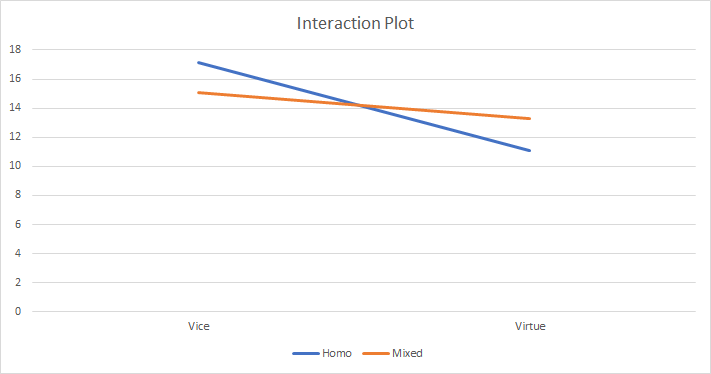

\begin{center}
    \LARGE
    \textbf{STAT 425 - Statistical Design and Analysis of Experiments}
 
    \vspace{0.3cm}
    \LARGE
    \textbf{Assignment 3}
    
    \large
    \noindent\makebox[\linewidth]{\rule{20cm}{0.8pt}}
    \textbf{Name:} Jana Osea \\
    \textbf{Student ID:} 30016679
    \noindent\makebox[\linewidth]{\rule{20cm}{0.8pt}}
\end{center}

```{r, include=FALSE}
library(ggplot2)
library(mosaic)
library(dplyr)
library(EnvStats)
library(lawstat)
library(DescTools)
library(gridExtra)
library(MASS)
library(car)
library(ggpubr)
```

\textbf{Problem 1} A petroleum company was interested in comparing the kilometres per litre of gas consumption achieved by four different brands of gasoline: Brand A, Brand B, Brand C, and Brand D. Due to the considerable variation due to differences amongst driving characteristics and car models, these two secondary factors/variables were included as blocking variables in this study. The investigators selected four different brands of cars and four different drivers. The drivers and brands of vehicle were then randomly assigned to gasoline brands in amanner diplayed in the following table.

(a) Which brand of gasoline belongs to each response inCar Modeltype 4 column?

    \textbf{Solution:} Column 4 will have the following gasoline brands.
    
    |        | Car Model |
    |--------|-----------|
    | Driver | 4         |
    | 1      | B(0.71)        |
    | 2      | C(0.56)       |
    | 3      | D(0.60)         |
    | 4      | A(0.74)         |

(b) Compute/provide the ANOVA table.

    \textbf{Solution:} Below is the R code for the ANOVA table output.
    
    ```{r}
    km <- c(0.74, 0.72, 0.57, 0.62, 
        0.61, 0.76, 0.74, 0.58,
        0.54, 0.60, 0.71, 0.70,
        0.71, 0.56, 0.60, 0.74)
    driver <- rep(c("1", "2", "3", "4"), 4)
    car <- c(rep(c("1"), 4), rep(c("2"), 4), rep(c("3"), 4), rep(c("4"), 4))
    brand <- c("A", "B", "C", "D", 
               "D", "A", "B", "C", 
               "C", "D", "A", "B", 
               "B", "C", "D", "A")
    p1 <- data.frame(km, driver, car, brand)
    p1.aov = aov(km ~ brand + driver + car, data=p1)
    summary(p1.aov)
    ```
    

(c) From your result in part (b), can you infer that 
    
    (i) there is a Driver Effect? \newline 
    \textbf{Solution:} We are testing if there is a Driver effect using the following hypothesis:
    
        $$\begin{array}{ll}
        {\rm H}_{0}: \beta_{Driver1} = \beta_{Driver2} = \beta_{Driver3} = \beta_{Driver4}= 0 & (\text{there is no Driver effect on the kilometres per litre of gas}) \\
        {\rm H}_{A}: {\rm H}_{0} \:\: \text{is false} & (\text{there exists Driver effect on the kilometres per litre of gas}) \\
        \end{array}$$
        
        From the ANOVA table in (b), we have that
        
        \begin{align*}
            F_{obs} &= 1.571 \\
            P-value &= P(F_{3, 6} > F_{obs}) = 0.29136
        \end{align*}
        
        Since the $P-value = P(F_{3, 6} > F_{obs}) = 0.29136$ is greater than 0.05, one would not reject the null hypothesis, and conclude from these data that there is no Driver effect--the mean kilometres per litre of gas is the same across the four different drivers. In other words, there is no "Driver" effect.
        
    (ii) a Car Model Effect? \newline
    \textbf{Solution:} We will test the following hypothesis:
        
        $$\begin{array}{ll}
        {\rm H}_{0}: \alpha_{Model1} = \alpha_{Model2} = \alpha_{Model3} = \alpha_{Model4}= 0 & (\text{there is no Car model effect on the kilometres per litre of gas}) \\
        {\rm H}_{A}: {\rm H}_{0} \:\: \text{is false} & (\text{there exists a Car model effect on the kilometres per litre of gas}) \\
        \end{array}$$
            From the ANOVA table in (b), we have that
        
        \begin{align*}
            F_{obs} &= 15.286 \\
            P-value &= P(F_{3, 6} > F_{obs}) = 0.00324
        \end{align*}
        
        Since the $P-value = P(F_{3, 6} > F_{obs}) = 0.00324$ is less than 0.05, one would reject the null hypothesis, and conclude from these data that the mean kilometres per litre of gas is not the same for the for different car models; or there is a "Car Model Effect."
    

(d) Is there a gasoline Brand Effect on the gas consumption, interms of kilometres per liter? If so, carryout the necessary multiple comparison method to identify which Brand of gasoline provides the bestfuel consumption.

    \textbf{Solution:} We will test the following test of hypothesis:
    
    $$\begin{array}{ll}
    {\rm H}_{0}: \tau_{A} = \tau_{B} = \tau_{C} = \tau_{D}= 0 & (\text{there is no gas Brand effect on the kilometres per litre of gas}) \\
    {\rm H}_{A}: {\rm H}_{0} \:\: \text{is false} & (\text{there is gas Brand effect on the kilometres per litre of gas}) \\
    \end{array}$$
            From the ANOVA table in (b), we have that
    
    \begin{align*}
        F_{obs} &=  491.857 \\
        P-value &= P(F_{3, 6} > F_{obs}) = 1.45e-07
    \end{align*}
    
    Since the $P-value = P(F_{3, 6} > F_{obs}) = 1.45e-07$ is less than 0.05, one would reject the null hypothesis, and conclude from these data that the mean kilometres per litre of gas is not the same for the for different gasoline brand effect; or there is a "Gasoline Brand Effect." We will now carry out a multiple comparison method to identify which Brand of gasoline provides the best fuel consumption.
    
    ```{r}
    p1.Tukey = TukeyHSD(p1.aov, conf.level=0.95, ordered=T)
    p1.Tukey$brand 
    mplot(p1.Tukey)
    # A > B > D > C
    ```
    
    From the table shown above, we can conclude that 
    
    $$\begin{array}{cccc}
      \text{Lower Bound}  & \mu_{i} - \mu_{j}  & \text{Upper Bound}  & \text{Finding} \\
      \hline
      0.0013              & \mu_{A} - \mu_{B}  &    0.0387           & \mu_{A} > \mu_{B} \\
      0.1563              & \mu_{A} - \mu_{C}  &    0.1937           & \mu_{A} > \mu_{C}  \\
      0.1113              & \mu_{A} - \mu_{D}  &    0.1487           &\mu_{A} > \mu_{D} \\
      0.1363              & \mu_{B} - \mu_{C}  &    0.1737           & \mu_{B} > \mu_{C} \\
      0.0913              & \mu_{B} - \mu_{D}  &   0.1287            & \mu_{B} > \mu_{D}  \\
      0.0263              & \mu_{D} - \mu_{C}  &    0.0637           & \mu_{D} > \mu_{C} \\
      \end{array}$$
    
    $$\mu_{A} > \mu_{B} > \mu_{D} > \mu_{C}$$
    
    This means that the Brand A of gasoline provides the best fuel consumption.

(e) Carry out the model diagnostic(s). Do the conditions of the model appear to hold?

    \textbf{Solution:} The condition of the Latin square model is that the residual terms, $e_{ijk}$s, are independent and Normally distributed random variables. 
    
    ```{r, echo=FALSE}
    e.terms = residuals(p1.aov)
    fit.terms = fitted(p1.aov)
    ggplot(data=p1.aov, aes(sample = e.terms)) + stat_qq(size=2, col="blue") + stat_qqline(col="red") + ggtitle("Normal Probability Plot of Residuals")
    ggplot(data=p1.aov, aes(x = fit.terms, y = e.terms)) + geom_point(size=2, col="blue") + xlab("Fitted Values") + ylab("Residuals") + geom_hline(yintercept=0, linetype="dashed", col="red")
    ```
    
    It is a little difficult to determine normality from these plots and so we will perform a Shapiro-Wilk test.
    
    ```{r}
    shapiro.test(e.terms)
    ```
  
  Since the p-value is less than 0.05, from these data we can conclude that the residuals are not normally distributed. Thus the condition for the Latin square model does not hold.
    
    
\newpage

\textbf{Problem 2} Refer to the data appearing in Question 1. How much more efficient is the experimental design employed
in Question 1 to

(a) a completely randomized design?

    \textbf{Solution:} We use the following formula
    
    $$RE(L^2, CRD) = \frac{MSBlock1 + MSBlock2 - (p-1)MSE}{(p + 1)MSE}$$
    
    ```{r}
    # ALL
    MSBlock1 <- 0.000092
    MSBlock2 <- 0.000892
    MSE <- 0.000058
    p <- 4

    num1 <- MSBlock1 + MSBlock2 - (p-1)*MSE
    den1 <- (p+1)*MSE
    RE1 <- num1/den1
    RE1
    ```
    
    One would need approximatley 2.793103 times more data if one were to compare the gasoline brands by collecting data from a completely randomized design as compared to a Latin square experimental design.
    
(b) a completely randomized block design where the 

    (i) Car Model is the blocking variable/factor? \newline
    \textbf{Solution:} We use the following formula
    
    $$RE(L^2, CRBlock1) = \frac{MSBlock2 + (p - 1)MSE}{p*MSE}$$
    
    ```{r}
    # Car model
    num3 <- MSBlock1 + (p-1)*MSE
    den3 <- p*MSE
    RE3 <- num3/den3
    RE3
    ```
    
    One would need approximatley need 1.146552 times more data if one were to compare the gasoline brands using a completely randomized block design where Car model is the blocking variable compared to a Latin square design.
    
    (ii) Driver is the blocking variable/factor? \newline
    \textbf{Solution:} Similar to the formula in $b(ii)$, we compute the relative efficiency and get
    
    ```{r}
    # driver
    num2 <- MSBlock2 + (p-1)*MSE
    den2 <- p*MSE
    RE2 <- num2/den2
    RE2
    ```
    
    One would need approximatley need 4.594828 times more data if one were to compare the gasoline brands using a completely randomized block design where Drive is the blocking variable compared to a Latin square design.
    
\newpage
\textbf{Problem 3} Is a person willing to pay more for a tempting vice option (ie, eating a hamburger, surfing the internet)
than a viruous option (ie, eating broccolli, reading the newspaper)? The benefits and costs of consumer
temptation was investigated in the Journal of Marketing Research (February 2012). In one experiment,
investigators employed a two-by-two factorial design involving 180 consumers. The first factor was whether
consumers were asked to imagine ordering a steak (vice) or organic pasta (virtue) at a restaurant. The other
factor varied in terms of the restaurant described the homogeneous in its offerings (either "only tasty, less
healthy dishes like steak") or offered a mixed menu ("both tasty, less healthy dishes like steak" and "healthy,
less tasty dishes like organic pasta"). Consumers were randomly assigned to one of the four order/menu
combinations and then asked to give the maximum amount (in $s) they would be willing to pay for their
choice. A partially completed ANOVA table follows:


(a) Compute the degrees of freedom associated with each of the sources of variation in the table above.

    \textbf{Solution:} The following table contains the corresponding degrees of freedom.
    
    |            |       *df*       |
    |------------|:--------------:|
    | Order      |      2-1=1     |
    | Menu       |      2-1=1     |
    | Order*Menu |  (2-1)(2-1)=1  |
    | Error      | 2 * 2 * (45-1)=176 |
    | Total      |  2 * 2 * 45-1=179  |
    
(b) Compute the value of SSAB.

    \textbf{Solution:} **taken out**
    
(c) Provide a practical interpretation of "what" is going on in these data.

    \textbf{Solution:} The data can be formed in the following fashion:
    
    $$\begin{array}{lcccc}
                     &    \text{Vice}                                  &   \text{Virtue}              \\
    \hline
    \text{Homogenous} &   x_{111}, x_{112}, \cdots, x_{1145}  &  x_{121}, x_{122}, \cdots, x_{1245}  \\
    \text{Mixed}  &        x_{211}, x_{212}, \cdots, x_{2145}   &  x_{221}, x_{222}, \cdots, x_{2245}    \\
    \end{array}$$

    This means that for each of the two order types (Vice or Virtuous), two kinds of menus will be given (Homogeneous and Mixed). We assume the for each combination of order and menu, the number of data points are the same (ie. $n_{ij} = 45 \forall i,j$). Each data point represents how much that customer is willing to pay for the assigned order. Hence, the data is split up into 4 different groups:
    
    \begin{enumerate}
      \item Vice, Homogeneous
      \item Vice, Mixted
      \item Virtuous, Homogeneous
      \item Virtuous, Mixed
    \end{enumerate}
    
    Each of which contain 45 data points from distinct customers that represent the amount of money they are willing to purchase the assigned order.
    
    
(d) In a follow up to the ANOVA, the investigators compared the mean willing to pay values for homogeneous and mixed-menu combinations at each level of the order condition. In the virtue condition, the mean amount a customer was willing to pay was $11.08; the mean amount will to pay for the mixedmenu option was $13.26. In the vice condition, the mean amount willing to pay was $17.11 for the homogeneous condition and $15.06 for the mixed-menu condition. Create the necessary visualization method which will enable you to enhance your understanding of these data from part (c).

    \textbf{Solution:} The given sample averages above can be summarized in the following table:
    
    |             |  Vice | Virtue |
    |-------------|:-----:|--------|
    | Homogeneous | 17.11 | 11.08  |
    | Mixed       | 15.06 | 13.26  |
    
    Since the summary statistics cannot be formed using R functions, we use Excel to produce a visualization of the interaction plot.
    
    ```{r pressure, echo=FALSE, fig.cap="Excel Generated Interaction Plot", out.width = '100%'}
    
    ```
    
    From the interaction plot above, it seems that sample given the Homogenenous menu is more willing to pay for the Vice order compared to the Mixed group. Furthermore, the sample given the Mixed menu is more willing to pay for the Virtue order compared to the Homogeneous group. For both groups, the amount they are willing to pay decreases as the order changes from Vice to Virtue. It is good to note from the table given that the P-value for OrderxMenu is < 0.001 which indicates that there is interaction between the Order an individual chooses and the Meny they are given.

\newpage

\textbf{Problem 4} An article in the Teaching of Psychology1 published the results of a study of whether a practice test helps students prepare for a final exam. Sutdents in an introductory psychology class were grouped according to heir class standing and whether they attended a review session or took a practice test prior to the final exam. The data appear in the following .csv file, with $n_{ij} = 22$ students falling within each combination of the "PREP" factor and the class "STANDING" factor. Each student was asked to rate their final exam preparation after they had written their final exam, on an 11-point scale from 0 (not helpful at all) to 10 (extremely helpful).

(a) Create an interaction plot. Does there appear to be an interaction effect? Comment.

    \textbf{Solution:} We use the following R code to produced an interation plot.
    
    ```{r}
    p4 <- read.csv("p4.csv")
    PREP <- p4$PREP
    RATING <- p4$RATING
    STANDING <- p4$STANDING
    interaction.plot(x.factor = PREP, 
                     trace.factor = STANDING, 
                     response=RATING, 
                     fun=mean, 
                     col=c("orange", "green", "blue"), 
                     xlab="PREP", 
                     ylab="Mean Final Prep Rate", 
                     main="Interaction Plot", lwd=2)
    ```
    
    Although all lines have the same direction in slope, there does not seem to be a significant interaction between all three standings because they all decrease in the rating when comparing from practice to review session.
    
    
(b) Statistically test the existence of an interaction. What can you conclude?

    \textbf{Solution:} We will test the following test of hypothesis:
    
    $$\begin{array}{ll}
    {\rm H}_{0}: (\tau\beta)_{ij}= 0 \:\:&\text{(there is no interaction between the preparation level and class standing}) \\
    {\rm H}_{A}: {\rm H}_{0}\:\: \text{is false}     &(\text{there is an interaction effect})
    \end{array}$$
    
    
    We will use the following R code to perform our test:
    
    ```{r}
    p4.aov <- aov(RATING~PREP*STANDING, data=p4)
    summary(p4.aov)
    ```
    
    From the above, we get that 
    
    \begin{align*}
        F_{obs} &= 1.772 \\
        P-value &= P(F_{2, 126} > F_{obs}) = 0.174244
    \end{align*}
    
    Since the $P-value = P(F_{2, 126} > F_{obs}) = 0.174244$ is greater than 0.05, one would not reject the null hypothesis, and conclude from these data that the mean response in rating is the same for all levels of preparedness and class standing. There is no interaction effect.
    
    
(c) Carry out the diagnostics for the model. Ensure you provide a visual that inspects each condition along with a brief commentary.

    \textbf{Solution:} There are three conditions that must be met:
    
    \begin{enumerate}
      \item The residuals, or $e_{ijl}$-terms, are Normally distributed with a mean of 0 and a variance $\sigma^{2}_{Common}$.
      \item The variation in the response variable for all k-level of Factor A is homogeneous with $\sigma^{2}_{Common}$.
      \item The variation in the response variable for all b-levels of Factor B is homogeneous with $\sigma^{2}_{Common}$.
    \end{enumerate}
      
    ```{r}
    residuals <- residuals(p4.aov)
    fitted <- fitted(p4.aov)
    p4.diag <- data.frame(residuals, fitted)
    ggplot(data=p4.diag, aes(sample = residuals)) + stat_qq(size=2, col="blue") + stat_qqline(col="red") + ggtitle("Normal Probability Plot of the Residuals")
    ggplot(data=p4.diag, aes(x = fitted, y = residuals)) + geom_point(size=2, col="blue") + xlab("Fitted") + ylab("Residuals") + ggtitle("Plot of Residuals to Standing Level Means") + geom_hline(yintercept=0, linetype="dashed", col="red")
    ```
      
    From the QQ plot of the residuals, the data does some seem to appear completely normal. In order to be sure, we perform a Shapiro-Wilk test to check for normality of the residuals.
    
    ```{r}
    shapiro.test(p4.diag$residuals)
    ```
    
    From the test above, the P-value=0.3496 which is greater than 0.05 and so based on this data, we do not reject the null hypothesis and conclude that the residuals are normally distributed. As well from the residual plot, we can see that the residuals are balanced around 0. Hence the first condition is satisfied.
    
    ```{r}
    favstats(RATING~PREP, data=p4.diag)
    favstats(RATING~STANDING, data=p4.diag)
    standing.means <- c(rep(4.909091, 44), rep(4.909091, 44), rep(4.159091, 44))
    prep.means <- c(rep(5.303030, 66), rep(4.015152, 66))
    p4.diag <- data.frame(residuals, fitted, RATING, PREP, STANDING, standing.means, prep.means)
    ggplot(data=p4.diag, aes(x = standing.means, y = residuals)) + geom_point(size=2, col="blue") + xlab("Means Response of Rating") + ylab("Residuals") + ggtitle("Plot of Residuals to Standing Level Means") + geom_hline(yintercept=0, linetype="dashed", col="red")
    ```
    
    From the residual plot above, we can say that there does not seem to be a distinct pattern in the standing means. Hence, the second condition is satisfied.
    
    ```{r}
    ggplot(data=p4.diag, aes(x = prep.means, y = residuals)) + geom_point(size=2, col="blue") + xlab("Means Response of Rating") + ylab("Residuals") + ggtitle("Plot of Residuals to Prep Level Means") + geom_hline(yintercept=0, linetype="dashed", col="red")
    ```
    
    From the residual plot above, we can say there there does not seem to be a distinct pattern in the prep means. Hence, the third condition is satisfied. Since all the conditions above are met, then we can say that the diagnostics for the model is satisfied.
  
    
(d) Is there a "PREP" effect? If so, identify the "PREP" method that best prepares a student for theirfinal exam. Use an overall $\alpha = 0.05$.

    \textbf{Solution:}  We will test the following hypothesis.
    
    $$\begin{array}{ll}
    {\rm H}_{0}: \beta_{Practice} = \beta_{Review} 0  & (\text{there is no PREP Effect; mean final preparation rating is the same for both methods}) \\
    {\rm H}_{A}: {\rm H}_{0} \:\:\text{is false}  & (\text{there IS A PREP Effect; mean final preparation rating is the not same for the 2 methods}) \\
    \end{array}$$
    
    We will use the following R code to perform the test:
    
    ```{r}
    summary(p4.aov)
    ```
    
    From which get that
    
    \begin{align*}
        F_{obs} &= 14.399 \\
        P-value &= P(F_{5, 10} > F_{obs}) = 0.000229
    \end{align*}
    
    Since the $P-value = P(F_{1, 126} > F_{obs}) = 0.000229$ is less than 0.05, one would reject the null hypothesis, and conclude from these data that the mean final preparation rating is not the same for the two methods 'PRACTICE' and 'REVIEW'; or there is PREP effect.
    
    Since there is a prep effect, we will perform a Tukey HSD method to determine which method best prepares a student for their final.
    
    ```{r}
    p4.Tukey <- TukeyHSD(p4.aov, conf.level=0.95, ordered=T)
    p4.Tukey$PREP
    ```
    
    From the table above, we can summarize that
    
    $$\begin{array}{cccc}
    \text{Lower Bound}   & \mu_{i} - \mu_{j}   & \text{Upper Bound}  & \text{Finding} \\
    \hline
    0.6162269            & \mu_{PRACTICE} - \mu_{REVIEW} &    1.959531            & \mu_{PRACTICE} > \mu_{REVIEW}
    \end{array}$$
    
    Based on these data, we can conclude that the Practice method best prepares students for their final exam.
    

(e) Is there a "STANDING" effect? If so, carry out a multiple comparison method using a 95% "family"level of confidence.

    \textbf{Solution:} We will test the following hypothesis
    
    $$\begin{array}{ll}
    {\rm H}_{0}: \tau_{High} = \tau_{Med} = \tau_{Low} = 0  & (\text{there is no Standing Effect; mean final preparation rating is the same for the 3 types of student standings}) \\
    {\rm H}_{A}: {\rm H}_{0}\:\:\text{is false}  & (\text{there is no Standing Effect; mean final preparation rating is not the same 3 types of student standings}) 
    \end{array}$$
    
    We will use the following R code to perform the test:
    
    ```{r}
    summary(p4.aov)
    ```
    
    From which get that
    
    \begin{align*}
        F_{obs} &= 2.170 \\
        P-value &= P(F_{2, 126} > F_{obs}) = 0.118386
    \end{align*}
    
    Since the $P-value =  P(F_{2, 126} > F_{obs}) = 0.118386$ is greater than 0.05, one would not reject the null hypothesis, and conclude from these data that the mean final preparation rating is the same for the three types of students standings; or there is no STANDING effect.
    
    
    
    
\newpage


\textbf{Problem 5} A travel agent wanted to investigate if there nightly-rate of a hotel room is different amongst the three major hotel chains: Marriott, Hilton, and Hyatt. She suspected that the city in which the hotel was located "was a factor", so she collected data by randomly picking a certain day, and observing the room-rate for a non-smoking, 2 queen-beds room for six certain Canadian cities. The data are found below:

(a) Consider the experimental design employed to collect these data. Suggest a model that can be applied to these data, defining all terms of the model.

    \textbf{Solution:} Since the travel agent wants to invesitage the nightly rate of a hotel room on three hotel chains with a *secondary fixed-factor* of cities, it is most appropriate to employ a Completely Randomized Block Design. Since we only have one hotel rate for every combination of city and hotel and so it further suggests that we use a Completely Randomized Block DesignThe following model would be used:
    
    \begin{align}
    X_{ij} = & \mu + (\mu_{i.} - \mu) + (\mu_{.j} - \mu) + e_{ij} \\
    X_{ij} = & \mu + \tau_{i} + \beta_{j} + e_{ij} \hspace{0.5in} \text{for}\:\:i = i = 1, 2, \cdots, k; j = 1, 2, \cdots, b
    \end{align}
    
    where 
    
    $$
    \begin{array}{ll}
    \tau_{i} = \mu_{i.} - \mu & (\text{effect of different hotels}) \\
    \beta_{j} = \mu_{.j} - \mu & (\text{effect of city factor block}) \\
    e_{ij}    = \text{random error term}
    \end{array}
    $$
    
(b) Analyze the residuals of this model.

    \textbf{Solution:} We plot the qq plot for the residuals of the data. 
    ```{r}
    p5 <- read.csv("p5.csv", header=TRUE)
    p5.1 <- data.frame(stack(p5), rep(p5[,1]))
    names(p5.1) <- c("rate", "hotel", "city")
    
    
    # (b)
    p5.aov <- aov(rate~hotel+city, p5.1)
    p5.1$fitted <- fitted(p5.aov)
    p5.1$residuals <- residuals(p5.aov)
    ggplot(data=p5.1, aes(sample = residuals)) + stat_qq(size=2, col="blue") + stat_qqline(col="red") + ggtitle("Normal Probability Plot of the Residuals")
    
    ggplot(data=p5.1, aes(x = fitted, y = residuals)) + geom_point(size=2, col="blue") + xlab("Means Response of Rating") + ylab("Residuals") + ggtitle("Plot of Residuals to Fitted Values") + geom_hline(yintercept=0, linetype="dashed", col="red")
    
    ```
    
    The plot above does not seem to give a strong indication that the residuals are normally distributed because the points do not following the line completely. Hence, we perform a Shapori-Wilk test to test for normality.
    
    ```{r}
    shapiro.test(p5.1$residuals)
    ```
    
    From which we get that the P-value=0.2803. Since the p-value is greater than 0.05, we fail to reject the null hypothesis and conclude that the residuals are normally distributed.
    
(c) Is there a "City Effect"? If so, identify what the City Effect is (use a confidence coefficient of 0.95).

    \textbf{Solution:} We test the folliwng hypothesis:
    
    $$\begin{array}{ll}
    {\rm H}_{0}: \beta_{1} = \beta_{2} = \cdots = \beta_{6} = 0 & \hspace{0.2in} (\text{the mean response is the same for all city blocking levels}) \\
    {\rm H}_{A}: {\rm H}_{0}\:\: \text{is false}
    \end{array}$$
    
    We use the following R code to perform the test
    
    
    ```{r}
    p5.aov <- aov(rate~hotel+city, p5.1)
    summary(p5.aov)
    ```
    
    From which get that
    
    \begin{align*}
        F_{obs} &= 1.139 \\
        P-value &= P(F_{5, 10} > F_{obs}) = 0.401
    \end{align*}
    
    Since the $P-value = P(F_{5, 10} > F_{obs}) = 0.401$ is greater than 0.05, one would not reject the null hypothesis, and conclude from these data that the mean nightly rate is the same for the six different citiest; or there is no city effect.
    
(d) Is there a "Hotel Chain Effect"? If so, identify which hotel chain as the cheapest room-rate.

    \textbf{Solution:} We will test the hypothesis:
    
    $$\begin{array}{ll}
    {\rm H}_{0}: \tau_{1} = \tau_{2} = \tau_{3} = 0 & \hspace{0.2in} (\text{the mean response is the same for all 3 hotels}) \\
    {\rm H}_{A}: {\rm H}_{0}\:\: \text{is false}
    \end{array}$$
    
    We use the following R code to perform the test
    
    ```{r}
    summary(p5.aov)
    ```
    
    From which get that
    
    \begin{align*}
        F_{obs} &= 1.441 \\
        P-value &= P(F_{2, 10} > F_{obs}) = 0.282
    \end{align*}
    
    Since the $P-value =  P(F_{2, 10} > F_{obs}) = 0.282$ is greater than 0.05, one would not reject the null hypothesis, and conclude from these data that the mean nightly rate is the same for all 3 hotels.
    
    
\newpage

\textbf{Problem 6} The following data was collected in an effort to investigate if the cost of an oil change (in $s) differs between a specialty (ie, specialized in oil changes) automotive repair shop or a general (ie, performs many auto repair/maintenance functions) repair shop. Three locations were chosen at random. The data appears in a stacked version in the ass4q6data.csv file below.

(a) Consider the model - a fixed, mixed, or random - effects model. Analyze the residuals.

    \textbf{Solution:} The model used appears to be a mixed model because the investigator chooses a *random* location with fixed types of repair shops (either autmotive repair or general). 
    
     
    ```{r}
    p6 <- read.csv("p6.csv", header=TRUE)
    p6.1 <- data.frame(stack(p6), rep(p6$C1.T, 3))
    names(p6.1) <- c("cost", "city", "shop_type")

    p6.1.aov <- aov(cost~city*shop_type, data=p6.1)
    p6.1$residuals <- residuals(p6.1.aov)
    p6.1$fitted <- fitted(p6.1.aov)
    ggplot(data=p6.1, aes(sample = residuals)) + stat_qq(size=2, col="blue") + stat_qqline(col="red") + ggtitle("Normal Probability Plot of the Residuals")
    ggplot(data=p6.1, aes(x = fitted, y = residuals)) + geom_point(size=2, col="blue") + xlab("Fitted") + ylab("Residuals") + ggtitle("Plot of Residuals to Fitted") + geom_hline(yintercept=0, linetype="dashed", col="red")
    ```
    
    The plot above does not seem to give a strong indication that the residuals are normally distributed because the points do not following the line completely. Hence, we perform a Shapiro-Wilk test to test for normality.
    
    ```{r}
    shapiro.test(p6.1$residuals)
    ```
    
    From which we get that the P-value=0.07694. Since the p-value is greater than 0.05, we fail to reject the null hypothesis and conclude that the residuals are normally distributed.
    
(b) Referring to part (a): Generate the ANOVA table.

    \textbf{Solution:} We use the following R code to produce the preliminary ANOVA table
    
    ```{r}
    summary(p6.1.aov)
    ```
    
    We perform the following calculations
    
    ```{r}
    msab <- 1.787
    mse <- 11.213
    msshop <- 0.720
    mscity <- 15.563
    mscity / msab 
    msshop / msab
    ```
    
    $$
    \begin{array}{lccccc}
    \text{Source of Variation}  & \text{Sum of Squares - SS}  &  df   &  \text{Mean Square - MS}  & \text{Test Statistic}\\
    \hline
    \text{City}                 &   31.13                    & 3 - 1 = 2                         &   15.563   &  8.70901                  \\
    \text{Shop Type}            &   0.72                 & 2 - 1 = 1                            &      0.720  & 0.4029099               \\
    \text{City*Shop Type}       &     3.57                  & (3 - 1)*(2 - 1) = 2               &     1.787   &   0.159           \\
    \text{Error}                &     134.56                 & 3*2*(3 - 1) = 12                 &     11.213                  \\
    \hline
    \text{Total}                & 169.98                    & 18-1=17
    \end{array}
    $$

(c) Does there appear to be an interaction effect? Carry out the appropriate statistical test.

    \textbf{Solution:}  We will perform the following test of hypothesis
    
    $$
    \begin{array}{ll}
    {\rm H}_{0}: \sigma^{2}_{\tau\beta} = 0 & (\text{There is no variation in all different combinations of City and Shop type}) \\
    {\rm H}_{A}: \sigma^{2}_{\tau\beta} > 0 & (\text{There is variation in all different combinations of City and Shop type}) \\
    \end{array}
    $$
    
    We will use the following R code to perform the test.
    
    ```{r}
    summary(p6.1.aov)
    ```
    
    From which get that
    
    \begin{align*}
        F_{obs} &= 0.159 \\
        P-value &= P(F_{2, 12} > F_{obs}) = 0.854
    \end{align*}
    
    Since the $P-value =  P(F_{2, 12} > F_{obs}) = 0.854$ is greater than 0.05, one would not reject the null hypothesis, and conclude from these data the variation between the three-different cities (random factor) and the shop type (fixed factor) on the cost of a oil change--there is no interaction effect.
    
    
(d) Do these data indicate that there is a "Service Centre" effect? Ensure you state the statistical hypotheses and provide the value of the test statistic, P-value, decision and conclusion.

    \textbf{Solution:} We will test the following hypothesis
    
    $$
    \begin{array}{ll}
    {\rm H}_{0}: \tau_{Specialty \:Chain} =  \tau_{General \: Service} = 0 & (\text{there does not exist a Service centre effectt; mean cost is the same}) \\
    {\rm H}_{A}: {\rm H}_{0} \: \text{is false} & (\text{there is a Service centre effect; mean cost is different for at least one service centre type})
    \end{array}
    $$
    
    We will use R to perform the test.
    ```{r}
    fobs <- msshop/msab
    pval <- 1-pf(fobs, 1, 2)
    c(fobs, pval)
    ```
    
    From which get that
    
    \begin{align*}
        F_{obs} &= 0.4029099 \\
        P-value &= P(F_{1, 2} > F_{obs}) = 0.5905176
    \end{align*}
    
    Since the $P-value = P(F_{1, 12} > F_{obs}) = 0.5905176$ is greater than 0.05, one would not reject the null hypothesis, and conclude from these data the mean cost of an oild is the same for the different shop type (fixed factor). There is no Service centre effect.
    
(e) Do these data indicate there is a "Location Effect"? Approach this as you did in part (d).

    \textbf{Solution:} We will test the following hypothesis
    
    $$
    \begin{array}{ll}
    {\rm H}_{0}: \sigma^{2}_{\beta} = 0 & (\text{there is no variation between all three locations with respect to the cost of an oil change}) \\
    {\rm H}_{A}: \sigma^{2}_{\beta} > 0   & (\text{there is  variation between all three locations with respect to the cost of an oul change}) \\
    \end{array}
    $$
    
    We will use R to perform the test.
    
    ```{r}
    fobs <- mscity/msab
    pval <- 1-pf(fobs, 2, 2)
    c(fobs, pval)
    ```
    
    From which get that
    
    \begin{align*}
        F_{obs} &= 8.7090095 \\
        P-value &= P(F_{2, 2} > F_{obs}) = 0.1029971
    \end{align*}
    
    Since the $P-value = P(F_{2, 2} > F_{obs}) = 0.1029971$ is greater than 0.05, one would not reject the null hypothesis, and conclude from these data the data that there is no variation between all the differenct locations in terms of the mean cost of an oil change. There is no locations effect.
    
\newpage
\textbf{Problem 7} A local news channel does a grocery comparison in Calgary on a monthly basis. Each time, a home
economist takes a basket of goods and records the price of the goods at the four supermarket chains in the
city. A summary of the data is given below. The complete data can be found. It should be noted that the amounts, and brands were exactly the same. For example, in the comparison of
blueberries, the same quantity (0.5 pint) was used.


Can you infer from these data that there is a Store Effect? If so, which store is the cheapest to purchase
your groceries? The most expensive? Completely analyze these data, and provide a half to three-quarter
page report of your finding(s).


\textbf{Solution:} From the description of the experiment, this data comes from a 2 Factorial Experimental Design with Store as one factor and  In order to check if the model we used is valid, we first have to satisfy the following assumptions:
    
\begin{enumerate}
  \item The residuals, or $e_{ijl}$-terms, are Normally distributed with a mean of 0 and a variance $\sigma^{2}_{Common}$.
  \item The variation in the response variable for all 35 grocery store item costs is homogeneous with $\sigma^{2}_{Common}$.
  \item The variation in the response variable for all 4 grocery store costs is homogeneous with $\sigma^{2}_{Common}$.
\end{enumerate}

```{r, echo=FALSE}
p7 <- read.csv("p7.csv")
p7.aov <- aov(Price~Store+Item, data=p7)
p7$residuals = residuals(p7.aov)
p7$fitted = fitted(p7.aov)
ggplot(data=p7, aes(sample = residuals)) + stat_qq(size=2, col="blue") + stat_qqline(col="red") + ggtitle("Normal Probability Plot of Residuals")
shapiro.test(p7$residuals)
```

From the plot and the Shapiro-Wilk test above, the P-value=5.138e-10 which is less than 0.05. One can conclude that the residuals for this model is not normally distributed. Hence, the model does not meet the normality condition. This may suggest that we should perform a transformation to normalize the residuals. For the sake of the analysis, we will assume that the normality condition of the residuals is satisfied. Furthermore, we will also assume that the variation in the costs between grocery store items is the same as well as the variation between the costs of all four grocery stores are the same. We will test the hypothesis:

$$\begin{array}{ll}
{\rm H}_{0}: \tau_{Coop} = \tau_{Safeway} = \tau_{Sobeys} =\tau_{Superstore} = 0 & \hspace{0.2in} (\text{the mean response is the same for all 4 grocey stores}) \\
{\rm H}_{A}: {\rm H}_{0}\:\: \text{is false}
\end{array}$$

We use the following R code to perform the test

```{r}
summary(p7.aov)
```

From which get that

\begin{align*}
    F_{obs} &= 3.438 \\
    P-value &= P(F_{3, 102} > F_{obs}) = 0.0197
\end{align*}

Since the $P-value = P(F_{3, 102} > F_{obs}) = 0.0197$ is less than 0.05, one would reject the null hypothesis, and conclude from these data that the mean item cost for groceries is the same for all 4 grocery stores. Thus, there is a store effect. We will now carry out a multiple comparison method to identify which brand of grocery store provides the cheapest cost for groceries.
    
```{r}
p7.Tukey = TukeyHSD(p7.aov, conf.level=0.95, ordered=T)
p7.Tukey$Store
```

We can summarize the findings above in the table as follows.

$$\begin{array}{cccc}
      \text{Lower Bound}   & \mu_{i} - \mu_{j}  & \text{Upper Bound}  & \text{Finding} \\
      \hline
      -0.0784              & \mu_{Safeway} - \mu_{Superstore}  &    1.1978      & \mu_{Safeway} = \mu_{Superstore} \\
      -0.0181               & \mu_{Sobeys} - \mu_{Superstore}  &    1.2581      & \mu_{Sobeys} = \mu_{Superstore}  \\
      0.0693               & \mu_{Coop} - \mu_{Superstore}     &    1.3456      & \mu_{Coop} > \mu_{Superstore} \\
      -0.5778               & \mu_{Sobeys} - \mu_{Safeway}     &    0.6984      & \mu_{Sobeys} = \mu_{Safeway} \\
      -0.4904               & \mu_{Coop} - \mu_{Safeway}       &    0.7858      & \mu_{Coop} = \mu_{Safeway} \\
      -0.5507              & \mu_{Coop} - \mu_{Sobeys}         &    0.7256      & \mu_{Coop} = \mu_{Sobeys} \\
      \end{array}$$
    
From the table shown above, we can conclude that 

$$\mu_{Coop} = \mu_{Safeway} = \mu_{Sobeys} \\ \mu_{Superstore} = \mu_{Safeway} = \mu_{Sobeys} \\ \mu_{Coop} > \mu_{Superstore}$$
From the table above, there is no conclusive evidence that one grocery store costs less than all the other grocery stores. However, we can say that Coop is definitely greater than Superstore. Hence, if a person was to choose between therese two stores, it would cost less to shop at Superstore.

However, if a person was to choose between Coop, Sobeys, and Safeway, there is no difference between these stores. And if a person was to choose between Superstore, Sobeys, and Safeway, there is also no difference between these stores.